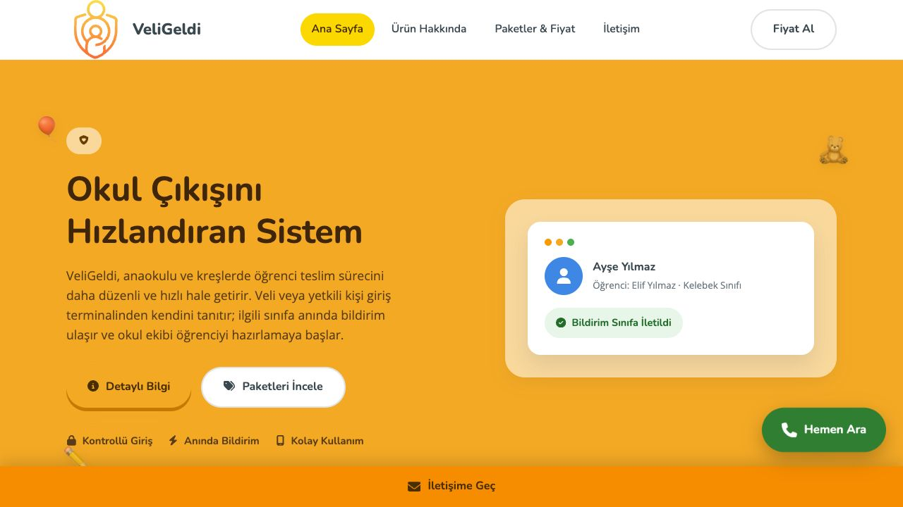
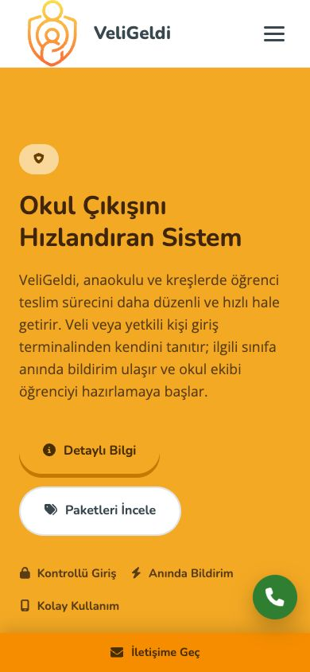

# Guardian Pickup Website

The official marketing website for Guardian Pickup, presented to customers under the VeliGeldi brand.

It is a responsive, Turkish-language product website for a digital student handover system designed for preschools. The site explains the entrance-terminal workflow, presents prepaid-credit and lifetime purchase options, and routes enquiries to the company through WhatsApp.

The project is intentionally implemented as a dependency-free static website. It can be served efficiently from a small virtual machine without a JavaScript framework, build pipeline, application server, or database.

> Production deployment to [veligeldi.com](https://veligeldi.com) is in progress.

## Preview

<p align="center">
  
  
</p>

## Project highlights

- Responsive layouts for mobile and desktop screens
- Semantic HTML, keyboard-accessible navigation, and focus-trapped enquiry dialogs
- Reduced-motion support for users who disable animations
- Optimized WebP images with responsive source sets
- Shared CSS, self-hosted fonts, and a reusable SVG icon sprite
- Clean, Turkish public routes backed by English source filenames
- SEO metadata, Open Graph tags, JSON-LD, `robots.txt`, and XML sitemap
- WhatsApp-based enquiry forms with native browser validation and a safe POST fallback
- No client-side tracking, database, or storage of form submissions
- Single-source header, footer, and enquiry-dialog templates
- Dependency-free validation script and GitHub Actions quality checks

## Technology

| Area | Implementation |
| --- | --- |
| Markup | Semantic HTML5 |
| Styling | CSS3, Grid, Flexbox, responsive media queries |
| Behaviour | Vanilla JavaScript |
| Assets | SVG icons, WebP/JPEG responsive images, self-hosted WOFF2 fonts |
| Hosting target | Nginx on an Ubuntu virtual machine |
| TLS target | Let's Encrypt |

No package installation or production build command is required.

## Engineering decisions

### Static-first delivery

The public website is a product and lead-generation surface, so a static architecture keeps the runtime small, fast, and easy to operate. Nginx can serve the complete website directly.

### Turkish customer experience, English codebase

All customer-facing content and public URLs remain Turkish. Source filenames, internal identifiers, comments, documentation, and maintenance scripts use English so the repository remains consistent and approachable for developers.

### Privacy-conscious enquiries

Form data is not sent to or stored by a backend. After native validation, the browser prepares a WhatsApp message and opens the official WhatsApp URL for the visitor to review and send.

### Progressive enhancement

The content remains readable without JavaScript. JavaScript adds the mobile menu, modal behaviour, reveal animations, lazy map loading, disabled-download feedback, and WhatsApp form handling.

### Shared HTML maintenance

Headers, footers, and enquiry dialogs are maintained in `templates/partials/`. After changing a shared partial, synchronize the deployable HTML pages:

```bash
node scripts/sync-shared-html.mjs
```

## Public routes

The production web server maps stable Turkish URLs to English source files:

| Public URL | Source file |
| --- | --- |
| `/` | `website/index.html` |
| `/urun` | `website/product.html` |
| `/fiyatlar` | `website/pricing.html` |
| `/iletisim` | `website/contact.html` |
| `/gizlilik` | `website/privacy.html` |
| `/indir` | `website/download.html` |

This separation keeps existing customer links unchanged while maintaining English developer-facing filenames.

## Repository structure

```text
.
├── .github/
│   └── workflows/
│       └── site-quality.yml
├── README.md
├── docs/
│   ├── screenshots/
│   │   ├── home-desktop.jpg
│   │   └── home-mobile.jpg
│   └── website.md
├── scripts/
│   ├── serve.mjs
│   ├── sync-shared-html.mjs
│   └── validate.mjs
├── templates/
│   └── partials/
│       ├── contact-modal.html
│       ├── header.html
│       └── page-footer.html
└── website/
    ├── css/
    │   └── site.css
    ├── contact.html
    ├── download.html
    ├── icons.svg
    ├── index.html
    ├── pricing.html
    ├── privacy.html
    ├── product.html
    ├── fonts/
    ├── img/
    ├── js/
    │   └── main.js
    ├── robots.txt
    └── sitemap.xml
```

## Run locally

The included development server preserves the same clean Turkish routes used in production.

```bash
node scripts/serve.mjs
```

Then visit [http://127.0.0.1:8080](http://127.0.0.1:8080).

To use a different port:

```bash
PORT=3000 node scripts/serve.mjs
```

## Validate

The quality check validates page metadata, local asset references, unique element IDs, JSON-LD, form fallbacks, shared styling, and product-claim guardrails.

```bash
node scripts/sync-shared-html.mjs --check
node scripts/validate.mjs
```

## Quality checklist

Before deployment:

1. Verify all six public routes on desktop and mobile viewports.
2. Test menu, modal, form validation, WhatsApp URL generation, and map loading.
3. Confirm every internal link returns a successful response.
4. Validate structured data and social metadata.
5. Confirm HTTP-to-HTTPS and `www` canonical redirects.
6. Run an accessibility and Lighthouse review against the production server.

## Documentation

Implementation details, design constraints, routing behaviour, and deployment requirements are documented in [docs/website.md](docs/website.md).

## Status

The website implementation and product-claim alignment are complete. Deployment to the company-managed Ubuntu infrastructure and production DNS configuration are the remaining release steps.

## Maintainer

Maintained by [Berkay Bakac](https://github.com/berkaybakac).

## License

This repository is private and proprietary. All rights reserved.
